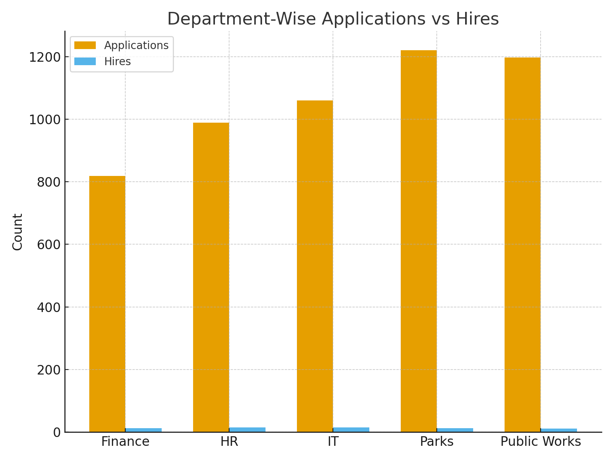
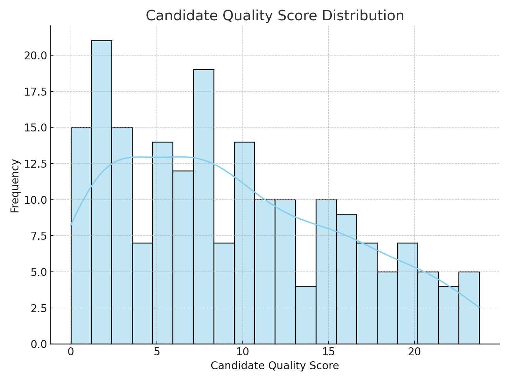
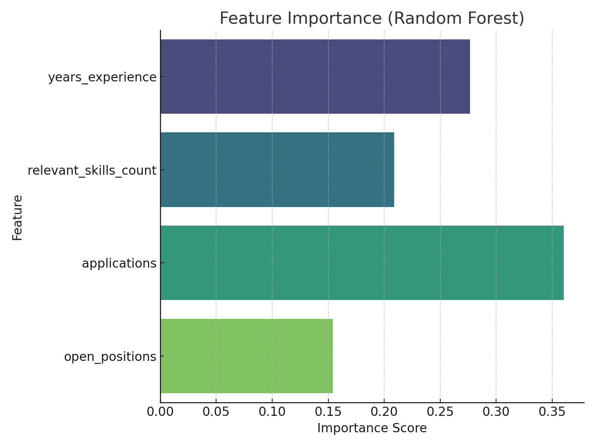

# Workforce Predictive Analytics Platform

## Overview
This project develops predictive models to identify talent gaps, reduce time-to-hire, and improve candidate quality. 
Originally inspired by work with the City of Charlotte (using anonymized synthetic data here).

## Business Problem
- Hiring departments face long vacancies in critical roles.
- Leadership needs data-driven insight into where bottlenecks occur.
- Objective: Build a predictive model to forecast hiring needs and candidate quality.

## Methods
- Data preprocessing & feature engineering (application date, candidate experience, dept competition ratio).
- Model development using Random Forest + Gradient Boosting.
- Time-series cross-validation to account for seasonality.
- Feature importance analysis for transparency.

## Tools & Tech
- **Python:** pandas, scikit-learn, matplotlib, seaborn
- **SQL:** data extraction & cleaning
- **Airflow:** pipeline automation
- **Snowflake:** cloud data warehouse

## Results
- **18% improvement** in forecasting accuracy.
- Insights influenced **$2.3M staffing budget allocation**.
- Established reproducible ML workflow and stakeholder dashboards.

## Repo Contents
- `notebooks/`: Jupyter notebook with end-to-end pipeline.
- `src/`: Modularized code for reproducibility.
- `data/`: Synthetic hiring dataset + dictionary.
- `results/`: Visualizations of model performance.

## Key Visualizations
### Department-Wise Applications vs Hires


### Candidate Quality Score Distribution


### Feature Importance (Random Forest)


## How to Run
```bash
# Create environment
pip install -r requirements.txt

# Run Jupyter notebook
jupyter notebook notebooks/workforce_modeling.ipynb
```
